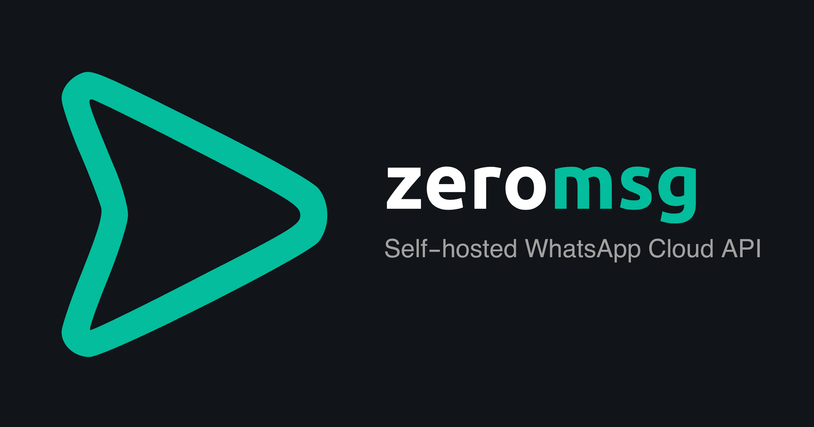
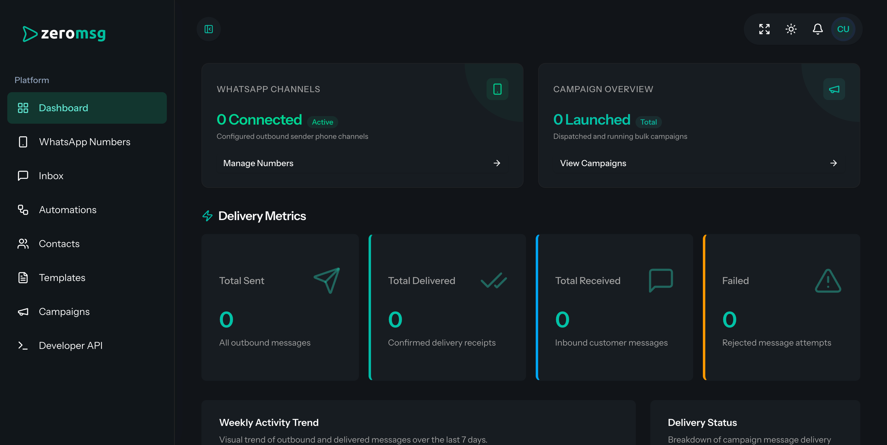
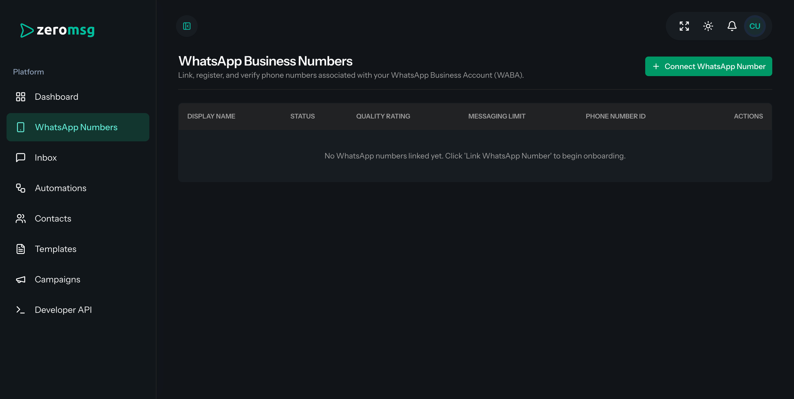
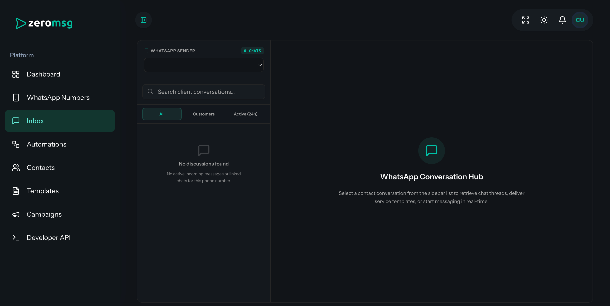
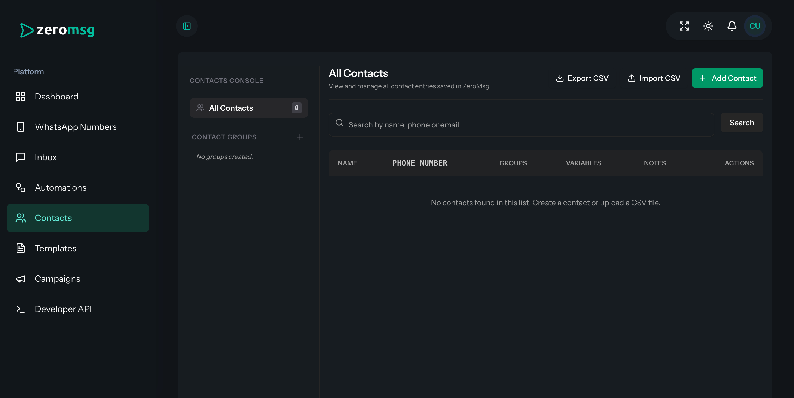

<p align="center">
  
</p>

<p align="center">
  <strong>Self-hosted WhatsApp Cloud API inbox, campaigns, automations, and developer API</strong>
</p>

<p align="center">
  <a href="#key-features">Features</a>
  ·
  <a href="#requirements">Requirements</a>
  ·
  <a href="#quick-install">Quick Install</a>
  ·
  <a href="#whatsapp-embedded-signup">WhatsApp Signup</a>
  ·
  <a href="#manual-install">Manual Install</a>
  ·
  <a href="#license">License</a>
</p>

<p align="center">
  
  
  
  
</p>

---

**ZeroMsg** is a self-hosted WhatsApp Cloud API dashboard for teams that want to connect their own Meta Business assets, manage WhatsApp numbers, handle conversations, send campaigns, build automations, and expose developer APIs from one clean, private workspace.

---

## Key Features

* 🌐 **Multi-Tenant Workspace Architecture**: Provision secure and isolated workspaces for different clients or teams automatically.
* 🔌 **Meta Embedded Signup**: Seamless onboarding of client numbers, WhatsApp Business Accounts (WABA), and system user access tokens using Meta's official signup flow.
* 💬 **Real-time Team Inbox**: Multi-agent shared inbox to handle incoming chats, send rich media, and utilize approved template messages.
* 📣 **Broadcast Campaigns**: Send highly-targeted message campaigns. Start, pause, resume, and import contacts instantly.
* 🤖 **Automation Flow Builder**: Drag-and-drop or node-based logic to auto-reply to customers based on keywords and events. Easily import/export automation flows.
* 📝 **Template Synchronization**: View and sync official WhatsApp templates directly from your Meta Business account.
* 👥 **Contacts & Segments**: Detailed contact profiles, CSV import/export, and group organization.
* ⚡ **Developer API & Webhooks**: Create custom API keys and subscribe to outbound webhooks to integrate ZeroMsg with external applications.

---

## Screenshots

<p align="center">
  
  
</p>
<p align="center">
  
  
</p>

---

## Requirements

- PHP 8.3+
- Composer
- Node.js and npm
- SQLite, MySQL, or PostgreSQL
- Meta developer app credentials for WhatsApp Embedded Signup

---

## Quick Install

Create a fresh instance and run the auto-installer:

```bash
composer create-project megoxv/zeromsg zeromsg
cd zeromsg
composer run zeromsg:install
composer run dev
```

Open the local app in your browser:
```text
http://localhost:8000
```
Register a new account from `/register`. ZeroMsg will automatically provision your new tenant workspace.

### Demo Data (Optional)

To seed a demo workspace for testing:
```bash
composer run zeromsg:demo
```
Log in using:
- **Email:** `client@zeromsg.com`
- **Password:** `password`

---

## WhatsApp Embedded Signup

ZeroMsg uses your Meta App details to facilitate direct Embedded Signup for your clients:

Configure these keys in your `.env` file:
```env
WHATSAPP_APP_ID=your_meta_app_id
WHATSAPP_APP_SECRET=your_meta_app_secret
WHATSAPP_CONFIG_ID=your_embedded_signup_config_id
```

Customers register their WhatsApp numbers in the dashboard at:
```text
/dashboard/whatsapp-accounts
```

---

## Manual Install

For developers cloning the repository directly:

```bash
composer install
npm install
cp .env.example .env
php artisan key:generate
php artisan migrate
npm run build
composer run dev
```

---

## Contributing

Contributions are welcome! Please feel free to submit a Pull Request.

## License

ZeroMsg is open-source software licensed under the [MIT](LICENSE) license.


